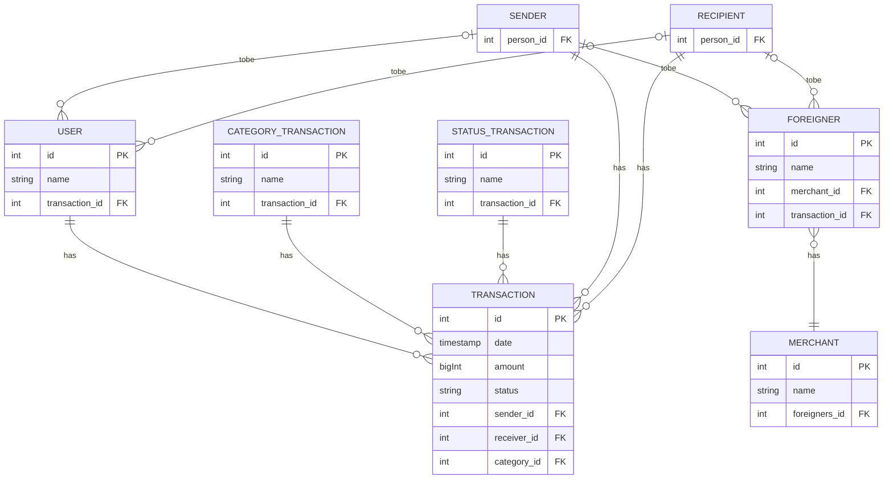

```mermaid
    erDiagram
    USER ||--o{ TRANSACTION : has
    USER {
        int id PK
        string name
        int transaction_id FK
    }

    
    TRANSACTION {
        int id PK
        timestamp date
        bigInt amount
        string status
        int sender_id FK
        int receiver_id FK
        int category_id FK
    }

    CATEGORY_TRANSACTION ||--o{ TRANSACTION : has
    CATEGORY_TRANSACTION {
        int id PK
        string name
        int transaction_id FK
    }

    FOREIGNER }o--|| MERCHANT : has
    FOREIGNER {
        int id PK
        string name
        int merchant_id FK
        int transaction_id FK
    }

    MERCHANT {
        int id PK
        string name
        int foreigners_id FK
    }

    STATUS_TRANSACTION ||--o{ TRANSACTION : has
    STATUS_TRANSACTION {
        int id PK
        string name
        int transaction_id FK
    }

    SENDER |o--o{ USER : tobe
    SENDER |o--o{ FOREIGNER : tobe
    SENDER ||--o{ TRANSACTION : has
    SENDER {
        int person_id FK
    }

    RECIPIENT |o--o{ USER : tobe
    RECIPIENT |o--o{ FOREIGNER : tobe
    RECIPIENT ||--o{ TRANSACTION : has
    RECIPIENT {
        int person_id FK
    }

```